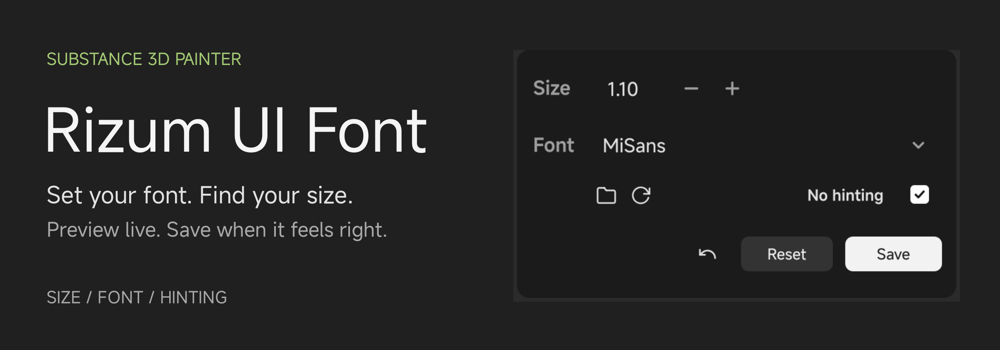

# Rizum Painter UI Font

Adjust Adobe Substance 3D Painter's interface font, preview changes live, and save the look that works for you.

[Download](https://github.com/Rizumu85/rizum-pt-ui-font/releases/latest) · [Installation](#installation) · [中文](README.zh-CN.md)

<p align="center">
  
</p>

## Panel

- **Size** — adjust the interface font scale.
- **Font** — use bundled MiSans (Regular, Medium, Bold) or add your own `.ttf` and `.otf` fonts.
- **No hinting** — try a different font-rendering preference and judge the result live.
- **Undo, Reset, Save** — step back, preview Painter's original font, or keep your changes.

Font settings are remembered between sessions.

## Installation

1. Download the plugin ZIP from the [latest release](https://github.com/Rizumu85/rizum-pt-ui-font/releases/latest) and extract it.
2. Place the `rizum-pt-ui-font` folder in Painter's Python plugins directory:

   ```text
   Documents/Adobe/Adobe Substance 3D Painter/python/plugins/rizum-pt-ui-font/
   ```

   `__init__.py` and `plugin.json` should be directly inside this folder, alongside `fonts/`, `i18n/`, `icons/`, and `rizum_ui/`.

3. Restart Painter and enable `Python > Plugins > rizum-pt-ui-font`.
4. Open **UI Font**, adjust **Size** or **Font**, and click **Save**.

## Try It Live

Changes apply immediately. **Save** keeps the current settings; closing the panel discards unsaved changes and returns to the last saved look.

The **undo arrow** reverts the previous live change. **Reset** previews Painter's original font settings; click **Save** to keep that reset.

To add a font, click the **folder icon**, place a `.ttf` or `.otf` file in `fonts/`, then click **refresh**. Select it from **Font** and preview it before saving.

## Compatibility & Fonts

This plugin uses Painter's Qt6 / PySide6 interface. It adjusts the application UI font only; document text, viewport overlays, and other plugins' custom fonts are left alone.

**MiSans is included.** Font files are provided by Xiaomi Inc. under the MiSans Font Intellectual Property License Agreement. Keep the bundled [third-party notices](THIRD_PARTY_NOTICES.md) when redistributing the plugin; fonts have separate terms from the plugin's MIT license.

<details>
<summary><strong>For maintainers: check a release folder</strong></summary>

Run from the plugin directory:

```sh
python distribution.py          # validate this checkout
python distribution.py build    # stage build/rizum-pt-ui-font/, validate it, and zip it
```

Validation checks version consistency, bundled UI files, icons, translations, font notices, and cache-file hygiene. The `build` command copies only the runtime files (no tests, README assets, or the Chinese README) into `build/`, runs the release checks on that folder, and writes `build/rizum-pt-ui-font-<version>.zip`.

The panel image can be regenerated with `python assets/readme/source/render_panel.py` using PySide6. It uses temporary settings and the bundled UI kit.

The banner uses an editable SVG layout and the panel image. Export it with `python assets/readme/source/render_hero.py`.

</details>
